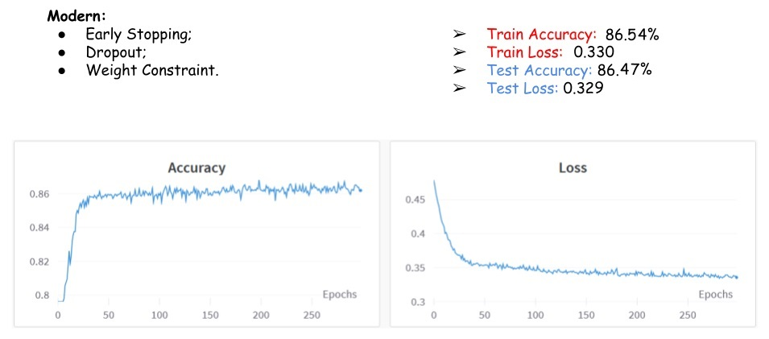

# Customer Churn Prediction
This is a machine learning project for customer churn prediction, using Neural Network (NN).
The project was developed during the Machine Learning (ML) discipline (EEC1509) of the Postgraduate Program in Electrical and Computer Engineering at the Technology Center of the Federal University of Rio Grande do Norte, in July 2022.

### Team
 - Supervisor: Prof. Ivanovitch (www.linkedin.com/in/ivanovitchm)

 - Developers: J. Marcos Leal (www.linkedin.com/in/macleal), Lucas Ismael (www.linkedin.com/in/lucasismaelcm).

Last Update: July 24, 2022.

## Project Purpose:
* Improve the performance of predicting customer churn from a particular service using Neural Network;
* Compare the performance of the neural network in relation to the classic decision tree method;
* Compare the techniques used to improve network learning and generalization.

## Project Description
This project develops a data transform pipeline and a Machine Learning Neural Network, using Jupyter Notebook, Weights & Bias, Pandas, Scikit-Learn and TensorFlow. The Jupyter Notebook script is [here](https://github.com/jmacleal/customer_churn_prediction_nn/blob/main/source/ml_project/churn_prediction_NN.ipynb).

The model development is composed of the following stages: 1) ``Extract, Transform and Load (ETL)``, 2) ``Data Check``, 3) ``Data Segregation``, 4) ``Trainning and Validation``, 5) ``Test``.
It is put in production and deployed using FastAPI, GitHub, PyTest, Git Actions and Heroku. See the aplication [here](https://customer--churn--prediction-nn.herokuapp.com/docs).
A big picture of the project is presented below.

To improve the learning and generalization of the network, the following strategies were implemented:

We use a Multi Hidden Layer (MLP) approach with 2 hidden layers using a Rectified Linear Unit (ReLU) activation function in order to fix the vanishing gradient problem, with a 2 node output layer with a Sigmoid activation function (Classification). Stochastic gradient descent (SGD) and Adam optimizers were tested with different learning rates and gradient clipping (Fix Exploding Gradient).

We also tested 3 sets of techniques to achieve better results:
* Classical: Use Early Stopping and Weight Decay (L2 Weight Regularization) + Batch Normalization;
* Alternate: Use Early Stpopping and added Noise with a Weight Constraint + Batch Normalization;
* Modern: Use Early Stopping and Dropout, in addition to a Weight Constraint.

## Results

Comparison with the decision tree model:

## References
[1] MITCHELL, Margaret et al. Model Cards for Model Reporting, 2019. Accessed May 30, 2022. Avaliable [here](https://arxiv.org/abs/1810.03993).

[2] https://www.thepythoncode.com/article/customer-churn-detection-using-sklearn-in-python

[3] https://colab.research.google.com/drive/1az3zBurhlcZfLJ2j2kZNlBtflsOQ5CUg?usp=sharing

[4] https://github.com/ivanovitchm/ppgeecmachinelearning.

[5] https://github.com/ivanovitchm/colab2mlops.

